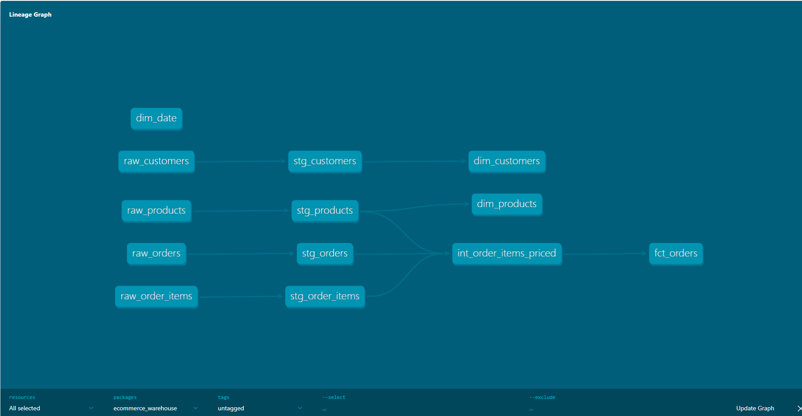
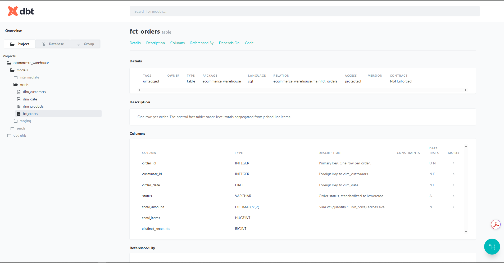

# dbt E-Commerce Warehouse

A dimensional model built with [dbt](https://www.getdbt.com/) that turns raw
e-commerce data (customers, products, orders, order items) into a proper
star schema — a fact table and supporting dimension tables — through
layered, tested, documented SQL models.

This is the analytics-engineering counterpart to the other two projects:
where [etl-weather-pipeline](https://github.com/Samuel-Adewusi/etl-weather-pipeline)
and [airflow-weather-orchestration](https://github.com/Samuel-Adewusi/airflow-weather-orchestration)
get raw data *into* a warehouse reliably, this project shows what happens
*inside* the warehouse once it's there: modeling it so analysts and BI
tools can actually use it.

## Why this project

Raw operational tables (orders, order line items, customers, products) are
usually normalized for transaction processing, not for reporting. A single
"how much did we sell last month by category" question can require several
joins across raw tables every time someone asks it. Dimensional modeling
does that join and aggregation work once, in version-controlled SQL, so
every downstream query and dashboard hits a clean, fast, well-understood
table instead of re-deriving business logic ad hoc.

## Architecture

```
        ┌───────────────────────────────┐
        │  seeds (stand-in for raw data)│   raw_customers, raw_products,
        │                                │   raw_orders, raw_order_items
        └───────────────┬───────────────┘
                         ▼
        ┌───────────────────────────────┐
        │           staging              │   stg_customers, stg_products,
        │   (light cleaning, renaming)   │   stg_orders, stg_order_items
        └───────────────┬───────────────┘
                         ▼
        ┌───────────────────────────────┐
        │         intermediate           │   int_order_items_priced
        │   (joins, line-level math)    │   (joins order_items to products,
        └───────────────┬───────────────┘    computes line amounts)
                         ▼
        ┌───────────────────────────────┐
        │             marts               │   fct_orders
        │   (star schema for BI)         │   fct_order_items
        │                                 │   dim_customers
        │                                 │   dim_products
        │                                 │   dim_date
        └───────────────────────────────┘
```

In a production version of this pipeline, the `seeds` layer would instead
be real raw tables landed by an ingestion job — for example, output from
the [Airflow orchestration project](https://github.com/Samuel-Adewusi/airflow-weather-orchestration)
writing into a `raw` schema. Seeds are used here so this project is fully
self-contained and runnable without needing an upstream pipeline first.

## Screenshots

**dbt lineage graph** — shows the full dependency chain from raw seeds through staging, intermediate, and marts:



**Generated documentation** for `fct_orders`, showing column descriptions and tests:



## Tech stack

- **dbt Core** — SQL transformations as version-controlled, tested code
- **dbt-utils** — cross-database utility macros (used here for `date_spine`
  to build `dim_date`)
- **DuckDB** — used as the local/CI target so the whole project runs with
  zero cloud setup and zero cost
- **BigQuery** — the intended production target; see below for pointing
  this project at a real BigQuery dataset instead

### Why DuckDB for local development and CI, and BigQuery for production

The project keeps most transformation logic warehouse-neutral where
practical. DuckDB provides fast, cost-free local and CI execution, while
adapter-specific SQL and configuration may still be required when
deploying to BigQuery — the `dim_date` model's day-of-week function is a
concrete example of exactly that kind of difference (see "Verified
working" below). Using DuckDB locally and in CI means anyone can clone
this repo and run the whole project in under a minute with no GCP
account, no billing, and no credentials, without pretending the same SQL
is guaranteed to run unmodified everywhere.

## Project structure

```
dbt-ecommerce-warehouse/
├── seeds/
│   ├── raw_customers.csv
│   ├── raw_products.csv
│   ├── raw_orders.csv
│   ├── raw_order_items.csv
│   └── schema.yml            # tests on the raw seed data itself
├── models/
│   ├── staging/
│   │   ├── stg_customers.sql
│   │   ├── stg_products.sql
│   │   ├── stg_orders.sql
│   │   └── stg_order_items.sql
│   ├── intermediate/
│   │   └── int_order_items_priced.sql
│   └── marts/
│       ├── dim_customers.sql
│       ├── dim_products.sql
│       ├── dim_date.sql
│       ├── fct_orders.sql
│       ├── fct_order_items.sql
│       └── schema.yml        # tests + docs on the star schema
├── ci/
│   └── profiles.yml           # DuckDB target only — no secrets, safe to commit
├── dbt_project.yml
├── packages.yml
├── profiles.yml.example       # template for pointing this at BigQuery
└── .github/workflows/ci.yml
```

## Running it locally (DuckDB — no cloud account needed)

1. Install dbt with the DuckDB adapter:
   ```bash
   pip install dbt-core dbt-duckdb
   ```
   (`dbt-utils` is a dbt *package*, not a pip package — it's declared in
   `packages.yml` and installed via `dbt deps` in the next step, not via pip.)
2. Point dbt at the local, secret-free profile included in this repo:
   ```bash
   dbt deps --profiles-dir ci
   dbt seed --profiles-dir ci
   dbt build --profiles-dir ci
   ```
   `dbt build` runs every model **and** every test in dependency order —
   if anything fails, it tells you exactly which model or test broke.
3. Explore the result:
   ```bash
   dbt docs generate --profiles-dir ci
   dbt docs serve --profiles-dir ci
   ```
   This opens an interactive lineage graph in your browser showing how
   `raw_orders` flows all the way through to `fct_orders`.

## Pointing this at BigQuery instead

1. Create a Google Cloud project and enable BigQuery (the free tier is
   generous enough for this project).
2. Create a service account with the "BigQuery Data Editor" and "BigQuery
   Job User" roles, and download its JSON key.
3. Copy `profiles.yml.example` to `~/.dbt/profiles.yml` (dbt's real config
   location, outside the repo) and fill in your project id, dataset name,
   and the path to your key file.
4. Run the same commands as above, without `--profiles-dir ci` (dbt will
   use `~/.dbt/profiles.yml` and the `bigquery` target by default):
   ```bash
   dbt deps
   dbt seed
   dbt build
   ```

## Verified working

Every model and every test in this project — including `dim_date`, which
uses a day-of-week function that can behave slightly differently across
database engines — has been run end to end with `dbt build --profiles-dir ci`
against DuckDB, with all models and tests passing.

## What the star schema looks like

This model has **two fact tables at different grains**, because a single
order can contain multiple products — one fact table can't cleanly answer
both "how many orders were placed" and "how much revenue came from each
product category":

- **`fct_orders`** — one row per **order**: `order_id`, `customer_id`,
  `order_date`, `status`, `total_amount`, `total_items`. Use this for
  order-level counts and totals.
- **`fct_order_items`** — one row per **order line item**: `order_item_id`,
  `order_id`, `customer_id`, `product_id`, `order_date`, `quantity`,
  `unit_price`, `line_amount`. Use this for anything product- or
  category-related — `fct_orders` has no `product_id`, so it literally
  can't answer those questions.
- **`dim_customers`** — one row per customer: id, name, email, region,
  signup date
- **`dim_products`** — one row per product: id, name, category, unit price
- **`dim_date`** — one row per calendar day for the year covered by the
  data, with day-of-week, month, and year broken out for easy filtering

Staging and intermediate models are materialized as views, while marts
are materialized as tables for BI consumption — views stay cheap and
always fresh for the light cleaning/joining layers, while the BI-facing
marts are built as physical tables so dashboards querying them don't
re-run the full transformation chain on every load.

Every model and column in `models/marts/schema.yml` is documented with a
description, which is what powers the generated docs site
(`dbt docs generate` / `dbt docs serve`) shown in the screenshots above.

### Sample analytics queries

Order-level total, straight off `fct_orders` — no joins needed:

```sql
SELECT
    c.region,
    SUM(f.total_amount) AS revenue
FROM fct_orders f
JOIN dim_customers c
    ON f.customer_id = c.customer_id
GROUP BY c.region
ORDER BY revenue DESC;
```

Revenue by product category — this is why `fct_order_items` exists;
`fct_orders` alone can't answer this since it has no `product_id`:

```sql
SELECT
    p.category,
    SUM(f.line_amount) AS revenue
FROM fct_order_items f
JOIN dim_products p
    ON f.product_id = p.product_id
GROUP BY p.category
ORDER BY revenue DESC;
```

## What the tests catch

- `not_null` and `unique` on every primary key in the seeds and the marts,
  catching duplicate or missing IDs before they reach a dashboard
- `relationships` tests confirming `fct_orders.customer_id` exists in
  `dim_customers`, `fct_order_items.product_id` exists in `dim_products`,
  `fct_order_items.order_id` exists in `fct_orders`, and both fact
  tables' `order_date` exists in `dim_date` — catching orphaned foreign
  keys anywhere in the model

## BigQuery: intended target, not yet verified

To be precise about what's actually been tested: **only the DuckDB path
has been run end to end** (see "Verified working" above). A BigQuery
profile template is included (`profiles.yml.example`) as the intended
cloud deployment path, but this repo does not claim end-to-end BigQuery
validation — if you point this at a real BigQuery dataset, treat it as
untested until you've run `dbt build` against it yourself.

## What I'd change at production scale

- Replace seeds with real `source()` tables landed by an ingestion job,
  and add `dbt source freshness` checks so stale raw data fails loudly.
- Add incremental materialization on both fact tables once order volume
  is too large to rebuild the full tables on every run.
- Add Elementary or a dbt Cloud–style test-failure alerting integration
  instead of relying on someone watching CI manually.
- Partition both fact tables by `order_date` in BigQuery for query
  performance and cost control at scale.
- Add a custom test asserting `line_amount = quantity * unit_price` on
  `fct_order_items`, and accepted-values / positive-value tests on
  `status` and `quantity`/`unit_price` — business-rule tests, not just
  structural ones.
